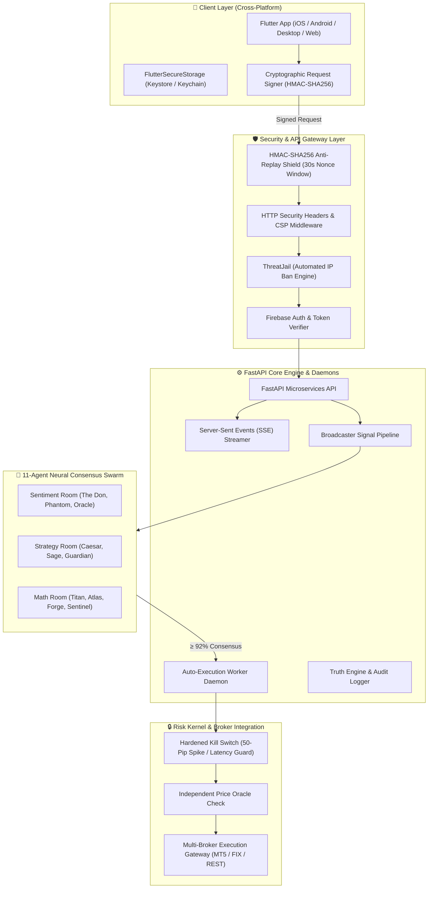
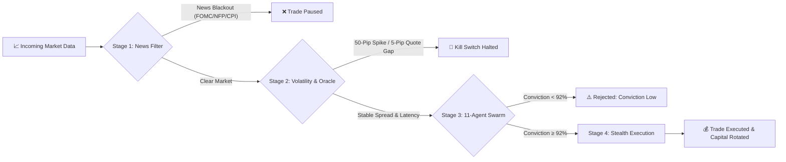

# 🏛️ MEHD AI — Institutional Quantitative Trading System

**MEHD AI** is an enterprise-grade, multi-agent quantitative trading platform designed to protect trader capital across Forex, Commodities, Crypto, and Equity Indices. It features an 11-agent AI voting consensus engine, real-time news blackout filters, sub-millisecond execution guards, and automated B-Book broker fraud auditing.

> **Note**: Core proprietary execution algorithms, model weights, and production keys are maintained in a private repository. This repository serves as an architectural showcase of system design, security patterns, and engineering implementations.

---

## 📐 System Architecture

---

## 🛡️ 4-Stage Defensive Execution Pipeline

Every market trade passes through four sequential defensive gates before execution is granted:

1. **Stage 1 — Secretary News Filter**: Scans global macroeconomic calendars in real-time. Automatically pauses trading 15 minutes before and after high-impact events (FOMC, NFP, CPI).
2. **Stage 2 — Volatility & Anti-Manipulation Detector**: Checks for 50-pip Black Swan spikes within 60s and verifies live broker prices against independent price oracles (flagging B-Book quote manipulation if > 5 pips).
3. **Stage 3 — 11-Agent AI Voting Consensus**: Evaluates market setups across Sentiment, Strategy, and Math rooms. Only setups reaching **≥ 92.0% weighted consensus** ("The Don Decided") are approved.
4. **Stage 4 — B-Book Radar Shield & Stealth Capital Rotator**: Audits connected broker metrics (slippage, latency, withdrawal honesty) and auto-rotates capital across accounts when weekly profit targets ($2.5k / $5k / $10k / $25k) are met.

---

## ⚡ Core Technical Features & Innovations

### 1. Military-Grade Security Architecture
- **HMAC-SHA256 Anti-Replay Shield**: Every sensitive API request is signed with client timestamp + UUID v4 nonce. Replay attacks after 30 seconds are rejected instantly.
- **ThreatJail Automated IP Defense**: Tracks suspicious payloads, rate limit violations, or malformed requests per IP, enforcing automated 15-minute IP bans.
- **Hardware Credential Encryption**: Integrates `EncryptedSharedPreferences` (Android Keystore) and iOS `KeychainAccessibility.first_unlock` for client credential storage.

### 2. Microservice & Daemon Infrastructure
- **Asynchronous Event Loops**: 7 independent background daemons orchestrating continuous market analysis, cleanup, and weekly performance scanning.
- **Real-Time SSE Streaming**: HTTP chunked Server-Sent Events delivering live agent votes and market snapshots to Flutter clients with < 10ms overhead.
- **Zero-Overhead State Sync**: Event-driven Firestore snapshot listeners updating client UI state atomically without polling.

### 3. Quantitative Risk Mathematics
- **Dynamic Lot Sizer**: Calculates position sizes based on exact dollar risk, pip values, and contract specs while enforcing a hard **50% margin safety cap**.
- **Kelly Criterion & Risk Ratios**: Automated win/loss probability weighting and downside semi-deviation (Sortino Ratio) tracking.
- **Z-Score Anomaly Detection**: Statistical rate-of-change monitoring to catch market flash crashes.

---

## 📊 Supported Asset Universe

The system supports high-liquidity assets accounting for over **85% of global market volume**:

- 💱 **Forex Majors**: `EUR/USD`, `GBP/USD`, `AUD/USD`, `USD/JPY`, `USD/CAD`
- 🥇 **Precious Metals**: `XAU/USD` (Gold)
- 📈 **Equity Indices**: `SPX500` (S&P 500), `NAS100` (Nasdaq 100)
- 🪙 **Crypto Assets**: `BTC/USD`, `ETH/USD`

---

## 💻 Tech Stack Summary

- **Backend**: Python 3.11, FastAPI, Pydantic, SlowAPI, Sentry, Asyncio
- **Frontend**: Flutter 3.x, Dart 3.x, Provider, Google Fonts, FL Chart
- **Database & Cloud**: Firebase Auth, Cloud Firestore, GCP Secret Manager, Docker
- **Security**: HMAC-SHA256, AES-256-GCM, TLS Certificate Pinning, ThreatJail

---

## 📄 License & Attribution

Architected & Developed by **Osman** (Backend & Quantitative Systems Engineer).

*Protected under proprietary trade secret guidelines. All rights reserved.*
