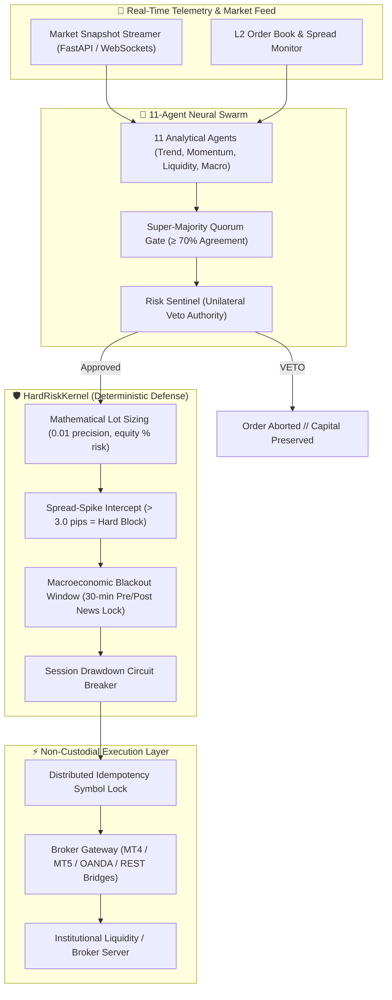

# 🏛️ ApexRisk-Core — Enterprise Quantitative Risk & Execution Kernel


**ApexRisk-Core** is an enterprise-grade, asynchronous quantitative execution and risk-enforcement backend built in Python. Designed as a high-throughput algorithmic decision workstation, it coordinates an **11-agent consensus voting swarm**, an unbypassable **HardRiskKernel** for deterministic capital preservation, and non-custodial broker execution bridges across Forex, Commodities, Equity Indices, and 24/7 Crypto.

---

## 📐 System Architecture


```mermaid
flowchart TD
    subgraph Ingestion ["📡 Real-Time Telemetry & Market Feed"]
        TICK["Market Snapshot Streamer (FastAPI / WebSockets)"]
        BOOK["L2 Order Book & Spread Monitor"]
    end

    subgraph Consensus ["🧠 11-Agent Neural Swarm"]
        SWARM["11 Analytical Agents (Trend, Momentum, Liquidity, Macro)"]
        VOTE["Super-Majority Quorum Gate (≥ 70% Agreement)"]
        SENTINEL["Risk Sentinel (Unilateral Veto Authority)"]
    end

    subgraph Defense ["🛡️ HardRiskKernel (Deterministic Defense)"]
        LOT["Mathematical Lot Sizing (0.01 precision, equity % risk)"]
        SPREAD["Spread-Spike Intercept (> 3.0 pips = Hard Block)"]
        NEWS["Macroeconomic Blackout Window (30-min Pre/Post News Lock)"]
        DD["Session Drawdown Circuit Breaker"]
    end

    subgraph Execution ["⚡ Non-Custodial Execution Layer"]
        LOCK["Distributed Idempotency Symbol Lock"]
        GATEWAY["Broker Gateway (MT4 / MT5 / OANDA / REST Bridges)"]
        BROKER["Institutional Liquidity / Broker Server"]
    end

    TICK --> SWARM
    BOOK --> SWARM
    SWARM --> VOTE
    VOTE --> SENTINEL
    SENTINEL -->|Approved| LOT
    SENTINEL -->|VETO| KILLED[Order Aborted // Capital Preserved]
    LOT --> SPREAD
    SPREAD --> NEWS
    NEWS --> DD
    DD --> LOCK
    LOCK --> GATEWAY
    GATEWAY --> BROKER
```

---

## ⚡ Core Engineering Subsystems

### 1. HardRiskKernel (`risk_engine.py`, `risk_evaluator.py`)
* **Deterministic Lot Sizing:** Eliminates human sizing errors by calculating position volume down to 0.01 lots based strictly on live broker equity, currency pair quote conversions, and user-configured risk thresholds.
* **Spread-Spike Intercept:** Continuously monitors broker spread differentials against typical rolling averages. If an artificial broker markup exceeds 3.0 pips during illiquidity or news events, entry is blocked instantly.
* **Macroeconomic News Blackout:** Integrates real-time economic calendar intelligence to freeze trade entry 30 to 45 minutes before and after high-impact events (CPI, NFP, FOMC rate decisions).
* **Circuit Breaker:** Enforces non-negotiable daily and trailing drawdown caps. If session loss limits are triggered, the engine trips a hardware lock, rejecting further executions.

### 2. 11-Agent Consensus Swarm (`consensus_engine.py`)
* **Decoupled Analytical Personas:** Dispatches market snapshots across 11 specialized intelligence models evaluating trend structure, momentum oscillators, liquidity sweeps, orderflow exhaustion, and macroeconomic sentiment.
* **Byzantine Quorum Filtering:** Requires a verifiable 70%+ directional consensus before any trade reaches the risk kernel.
* **Sentinel Veto Power:** Risk Sentinel acts as an independent guardian. If anomalous volatility or execution latency is detected, Sentinel triggers a unilateral veto, overriding directional agents.

### 3. Asynchronous Execution Gateway (`master_execution_engine.py`, `broker_gateway.py`)
* **Stateless Ephemeral RAM Transit:** Non-custodial API architecture. Credentials transit in ephemeral process memory without persistent plaintext storage.
* **Distributed Idempotency:** Implements symbol-level locks to prevent double-execution races during high-frequency volatility spikes.
* **Fill Reconciliation Loop:** Continuous ghost-trade detection comparing broker ledger balances against local state machines to ensure zero slippage drift.

### 4. Cryptographic Webhook Security (`routes/payments.py`, `auth.py`)
* **HMAC-SHA256 Verification:** Full signature verification for incoming payment webhooks (Paddle & Paystack) with sub-second timestamp replay validation.
* **Instant Provisioning & Revocation:** Automated tier entitlement gating (Core 8 assets / Precision 14 assets / Sovereign 20 assets) with immediate dispute/refund revocation handlers.

---

## 🧪 Automated Test Suite (240/240 Passing)

The engine is engineered with extreme test rigor. The automated suite covers mathematical accuracy, concurrency races, chaos edge cases, and broker gateway fault tolerance:

```bash
$ pytest -q
........................................................................ [ 30%]
........................................................................ [ 60%]
........................................................................ [ 90%]
........................                                                 [100%]
240 passed in 7.71s
```

### Key Test Coverage:
* `tests/test_risk_engine.py` — Lot sizing formulas, pip conversion, drawdown circuit breakers.
* `tests/test_consensus_engine.py` — Multi-agent quorum calculation, tie-breaking, Sentinel veto behavior.
* `tests/test_payments.py` & `tests/test_payment_security.py` — HMAC signature validation, replay attack prevention, asset tier gating.
* `tests/test_broker_gateway_v2.py` — Order formatting, stop loss validation, execution timeout handling.
* `tests/test_chaos_and_edge_cases.py` — Network disconnects, malformed market feeds, concurrent execution locks.

---

## 🚀 Quickstart & Local Verification

### Prerequisites
* Python 3.11 or 3.12
* Virtual Environment (`venv`)

### Setup & Run Tests
```bash
# Clone the repository
git clone https://github.com/amazing200guy1-a11y/fintech-backend-showcase.git
cd fintech-backend-showcase/mehd-ai/backend

# Create and activate virtual environment
python -m venv venv
# Windows:
.\venv\Scripts\Activate.ps1
# Linux/macOS:
source venv/bin/activate

# Install dependencies
pip install -r requirements.txt

# Run the 240-test automated suite
pytest -q
```

---

## 👨‍💻 Author & Engineering Pedigree

* **Architect & Lead Developer:** Usman Abayomi Bamidele ([@amazing200guy1-a11y](https://github.com/amazing200guy1-a11y))
* **Architecture:** Asynchronous Event-Driven Microservices / Quantitative Risk Infrastructure
* **License:** MIT Open Source