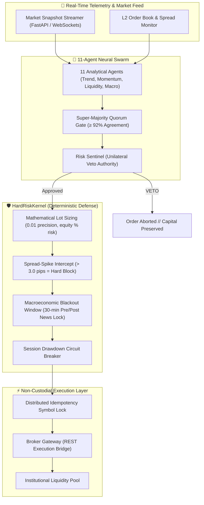

# ApexRisk-Core: Enterprise Quantitative Risk & Execution Engine


**ApexRisk-Core** is an enterprise-grade, asynchronous quantitative execution and risk-enforcement backend built in Python. It coordinates an **11-agent consensus voting swarm**, an unbypassable **HardRiskKernel** for deterministic capital preservation, and non-custodial execution bridges across Forex, Commodities, Equity Indices, and Crypto.

Visualized live on the **[Sovereign Cockpit UI](https://sovereign-cockpit-ui.vercel.app)**.

---

## 📐 System Architecture


```mermaid
flowchart TD
    subgraph Ingestion ["📡 Real-Time Telemetry & Market Feed"]
        TICK["Market Snapshot Streamer (FastAPI / WebSockets)"]
        BOOK["L2 Order Book & Spread Monitor"]
    end

    subgraph Consensus ["🧠 11-Agent Neural Swarm"]
        SWARM["11 Analytical Agents (Trend, Momentum, Liquidity, Macro)"]
        VOTE["Super-Majority Quorum Gate (≥ 92% Agreement)"]
        SENTINEL["Risk Sentinel (Unilateral Veto Authority)"]
    end

    subgraph Defense ["🛡️ HardRiskKernel (Deterministic Defense)"]
        LOT["Mathematical Lot Sizing (0.01 precision, equity % risk)"]
        SPREAD["Spread-Spike Intercept (> 3.0 pips = Hard Block)"]
        NEWS["Macroeconomic Blackout Window (30-min Pre/Post News Lock)"]
        DD["Session Drawdown Circuit Breaker"]
    end

    subgraph Execution ["⚡ Non-Custodial Execution Layer"]
        LOCK["Distributed Idempotency Symbol Lock"]
        GATEWAY["Broker Gateway (REST Execution Bridge)"]
        BROKER["Institutional Liquidity Pool"]
    end

    TICK --> SWARM
    BOOK --> SWARM
    SWARM --> VOTE
    VOTE --> SENTINEL
    SENTINEL -->|Approved| LOT
    SENTINEL -->|VETO| KILLED[Order Aborted // Capital Preserved]
    LOT --> SPREAD
    SPREAD --> NEWS
    NEWS --> DD
    DD --> LOCK
    LOCK --> GATEWAY
    GATEWAY --> BROKER
```

---

## ⚡ Core Engineering Subsystems

### 1. HardRiskKernel (`risk_engine.py`, `risk_evaluator.py`)
* **Deterministic Lot Sizing:** Calculates position volume to 0.01-lot precision from live broker equity, currency quote conversions, and user-configured risk thresholds. Zero human sizing discretion.
* **Spread-Spike Intercept:** Monitors broker spread against rolling averages. Broker markup exceeding 3.0 pips during illiquid or news-driven periods triggers an immediate hard block.
* **Macroeconomic News Blackout:** Integrates real-time economic calendar intelligence to freeze trade entry 30–45 minutes around high-impact events (CPI, NFP, FOMC rate decisions).
* **Circuit Breaker:** Enforces non-negotiable daily and trailing drawdown caps with a hardware execution lock.

### 2. 11-Agent Consensus Swarm (`consensus_engine.py`)
* **Decoupled Analytical Personas:** Dispatches market snapshots across 11 specialized intelligence models evaluating trend structure, momentum oscillators, liquidity sweeps, orderflow exhaustion, and macroeconomic sentiment.
* **Byzantine Quorum Filtering:** Requires ≥ 92% directional consensus before any trade reaches the risk kernel.
* **Sentinel Veto Power:** Risk Sentinel acts as an independent guardian with unilateral override authority.

### 3. Asynchronous Execution Gateway (`master_execution_engine.py`, `broker_gateway.py`)
* **Stateless Ephemeral RAM Transit:** Non-custodial architecture. Credentials transit in ephemeral process memory without persistent plaintext storage.
* **Distributed Idempotency:** Symbol-level locks prevent double-execution races during high-frequency volatility spikes.
* **Fill Reconciliation Loop:** Continuous ghost-trade detection comparing broker ledger balances against local state machines.

### 4. Cryptographic Webhook Security (`routes/payments.py`, `auth.py`)
* **HMAC-SHA256 Verification:** Full signature verification for incoming payment webhooks with sub-second timestamp replay validation.
* **Instant Tier Provisioning & Revocation:** Automated entitlement gating with immediate dispute/refund revocation handlers.

---

## 🧪 Automated Test Suite (240/240 Passing)

```bash
$ pytest -q
.....................................................................[30%]
.....................................................................[60%]
.....................................................................[90%]
........................                                             [100%]
240 passed in 7.71s
```

### Key Test Coverage:
* `tests/test_risk_engine.py` — Lot sizing formulas, pip conversion, drawdown circuit breakers.
* `tests/test_consensus_engine.py` — Multi-agent quorum calculation, tie-breaking, Sentinel veto behavior.
* `tests/test_payments.py` — HMAC signature validation, replay attack prevention, tier gating.
* `tests/test_broker_gateway_v2.py` — Order formatting, stop loss validation, execution timeout handling.
* `tests/test_chaos_and_edge_cases.py` — Network disconnects, malformed market feeds, concurrent execution locks.

---

## 🚀 Quickstart & Local Verification

### Prerequisites
* Python 3.11 or 3.12
* Virtual Environment (`venv`)

### Setup & Run Tests
```bash
# Clone the repository
git clone https://github.com/amazing200guy1-a11y/fintech-backend-showcase.git
cd fintech-backend-showcase/backend

# Create and activate virtual environment
python -m venv venv
source venv/bin/activate   # Windows: .\\venv\\Scripts\\Activate.ps1

# Install dependencies
pip install -r requirements.txt

# Run the 240-test automated suite
pytest -q
```

---

## 👨‍💻 Author & Engineering Pedigree

**Usman Abayomi Bamidele**
Senior Backend & AI Systems Engineer

- 🌐 **Live Telemetry Interface:** [sovereign-cockpit-ui.vercel.app](https://sovereign-cockpit-ui.vercel.app)
- 🐙 **GitHub:** [@amazing200guy1-a11y](https://github.com/amazing200guy1-a11y)
- 💼 **LinkedIn:** [linkedin.com/in/usman-bamidele](https://www.linkedin.com/in/usman-bamidele)
- ✉️ **Contact:** [usmanbamidele200@gmail.com](mailto:usmanbamidele200@gmail.com)

*Proprietary production binaries and live execution credentials remain private. License: MIT Open Source.*