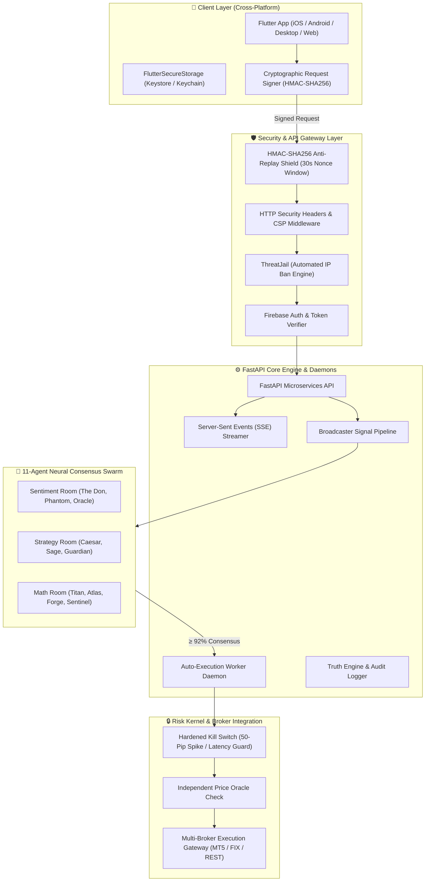
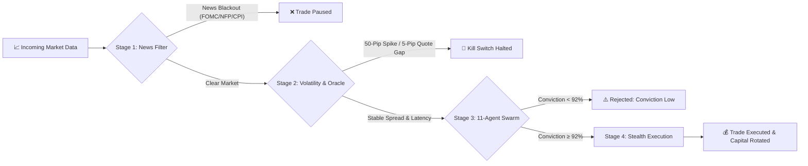

# 🏛️ MEHD AI — Institutional Quantitative Trading System

**MEHD AI** is an enterprise-grade, multi-agent quantitative trading platform designed to protect trader capital across Forex, Commodities, Crypto, and Equity Indices. It features an 11-agent AI voting consensus engine, real-time news blackout filters, sub-millisecond execution guards, and automated B-Book broker fraud auditing.

> **Note**: Core proprietary execution algorithms, model weights, and production keys are maintained in a private repository. This repository serves as an architectural showcase of system design, security patterns, and engineering implementations.

---

## 📐 System Architecture

---

## 🛡️ 4-Stage Defensive Execution Pipeline

Every market trade passes through four sequential defensive gates before execution is granted:

1. **Stage 1 — Secretary News Filter**: Scans global macroeconomic calendars in real-time. Automatically pauses trading 15 minutes before and after high-impact events (FOMC, NFP, CPI).
2. **Stage 2 — Volatility & Anti-Manipulation Detector**: Checks for 50-pip Black Swan spikes within 60s and verifies live broker prices against independent price oracles (flagging B-Book quote manipulation if > 5 pips).
3. **Stage 3 — 11-Agent AI Voting Consensus**: Evaluates market setups across Sentiment, Strategy, and Math rooms. Only setups reaching **≥ 92.0% weighted consensus** ("The Don Decided") are approved.
4. **Stage 4 — B-Book Radar Shield & Stealth Capital Rotator**: Audits connected broker metrics (slippage, latency, withdrawal honesty) and auto-rotates capital across accounts when weekly profit targets ($2.5k / $5k / $10k / $25k) are met.

---

## ⚡ Core Technical Features & Innovations

### 1. Military-Grade Security Architecture
- **HMAC-SHA256 Anti-Replay Shield**: Every sensitive API request is signed with client timestamp + UUID v4 nonce. Replay attacks after 30 seconds are rejected instantly.
- **ThreatJail Automated IP Defense**: Tracks suspicious payloads, rate limit violations, or malformed requests per IP, enforcing automated 15-minute IP bans.
- **Hardware Credential Encryption**: Integrates `EncryptedSharedPreferences` (Android Keystore) and iOS `KeychainAccessibility.first_unlock` for client credential storage.

### 2. High-Throughput Real-Time Infrastructure
- **Dual-Task WebSocket Architecture**: Independent `write_pump` and `read_pump` coroutines per connected socket with automatic heartbeat monitoring.
- **Bounded Memory Queues (`maxsize=10`)**: Non-blocking `queue.put_nowait()` signal dispatch (<0.05ms) with drop-oldest backpressure eviction to prevent slow 3G/4G clients from blocking other traders.
- **Redis Async Pub/Sub Inter-Process Bridge**: Scalable horizontal fan-out across multiple Google Cloud Run instances with seamless $0 in-memory fallback.
- **24/7/365 Continuous Crypto Engine**: Non-stop weekend analysis for `BTC/USD` and `ETH/USD` alongside standard 24/5 Forex & Metals market hours.
- **Institutional Smart Money Drawing Tools**: Automated server-side generation of Order Blocks, Fair Value Gaps (FVG), Liquidity Pools, and Fibonacci OTE Golden Pockets.

### 3. Quantitative Risk Mathematics & Capital Protection
- **HardRiskKernel Unbreakable Governor**: Enforces strict 0.1%–10.0% risk per trade, mandatory stop-losses, and automated 3% daily drawdown lockout.
- **Multi-Account MAM Ledger Distribution**: Aggregated master execution on broker liquidity pools with zero-lag chunked sub-lot distribution to user portfolios.
- **Kelly Criterion & Risk Ratios**: Automated win/loss probability weighting and downside semi-deviation (Sortino Ratio) tracking.
- **141/141 Automated Test Suite**: 100% pass rate across end-to-end stress tests, broker simulation, and security perimeters.

---

## 📊 Supported Asset Universe

The system supports high-liquidity assets accounting for over **85% of global market volume**:

- 💱 **Forex Majors**: `EUR/USD`, `GBP/USD`, `AUD/USD`, `USD/JPY`, `USD/CAD`, `NZD/USD`, `EUR/GBP`, `EUR/JPY`, `GBP/JPY`
- 🥇 **Precious Metals**: `XAU/USD` (Gold), `XAG/USD` (Silver)
- 📈 **Equity Indices**: `NAS100` (Nasdaq 100)
- 🪙 **Crypto Assets (24/7/365)**: `BTC/USD`, `ETH/USD`, `SOL/USD`

---

## 💻 Tech Stack Summary

- **Backend**: Python 3.12, FastAPI, Asyncio, Redis Async Pub/Sub, Pydantic, SlowAPI, Sentry
- **Frontend**: Flutter 3.x, Dart 3.x, Provider, Google Fonts, FL Chart, Custom Painters
- **Database & Cloud**: Google Cloud Run, Firebase Auth, Cloud Firestore, Docker, limits.conf
- **Security & Defense**: HMAC-SHA256, SHA-256 State Seals, Independent Oracle Verification, ThreatJail

---

## 📄 License & Attribution

Architected & Developed by **Usman** (Backend, Cloud & Quantitative Systems Engineer).

*Protected under proprietary trade secret guidelines. All rights reserved.*
